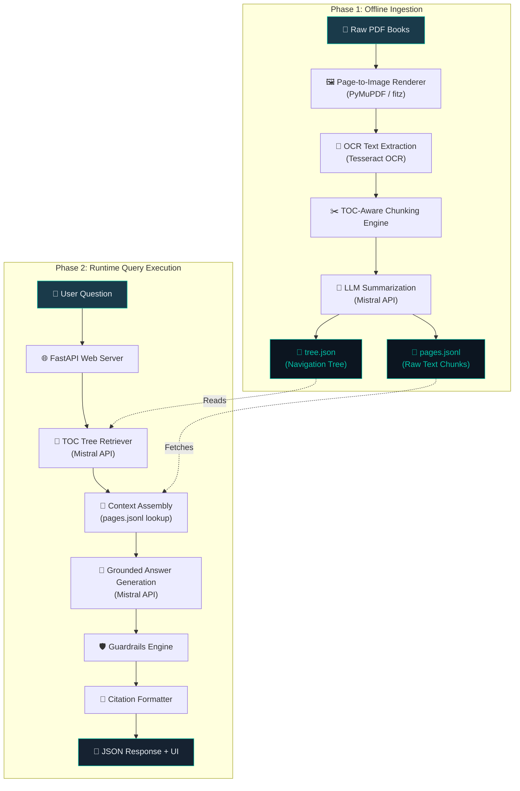
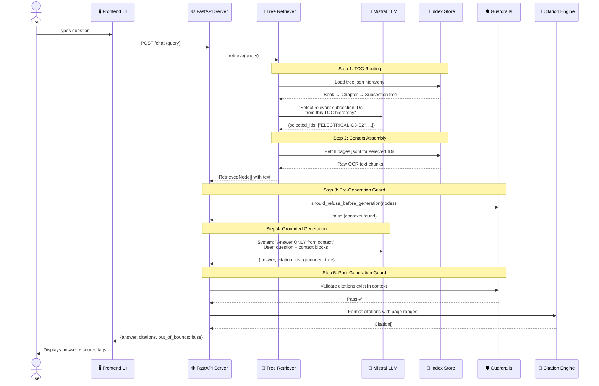
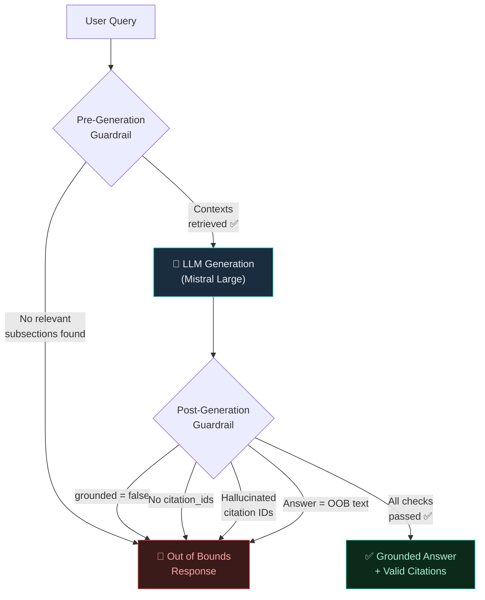
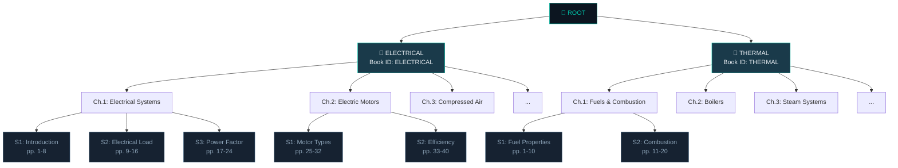

<p align="center">
  
  
  
  
  
</p>

<h1 align="center">Carbon Tatva — Vectorless RAG Chatbot</h1>

<p align="center">
  <strong>A production-grade, TOC-based Retrieval-Augmented Generation chatbot that answers questions from BEE Energy Efficiency Guide Books — without using any vector database.</strong>
</p>

<p align="center">
  <a href="https://toc-vectorless-rag-chatbot.vercel.app">🌐 Live Demo</a> •
  <a href="#architecture">📐 Architecture</a> •
  <a href="#getting-started">🚀 Getting Started</a> •
  <a href="#how-it-works">⚙️ How It Works</a>
</p>

---

## 📖 Overview

This project implements a **Vectorless RAG (Retrieval-Augmented Generation)** system that replaces traditional vector embeddings and similarity search with a **hierarchical Table of Contents (TOC) tree** built using LLM-powered semantic summarization. The chatbot is designed to answer questions strictly grounded in two BEE (Bureau of Energy Efficiency) Guide Books:

1. **BEE Guide — Electrical Utilities** (Energy Efficiency in Electrical Systems, Motors, Compressed Air, etc.)
2. **BEE Guide — Thermal Utilities** (Fuels & Combustion, Boilers, Steam Systems, Heat Exchangers, etc.)

### Key Differentiators

| Feature | Traditional RAG | This Project (Vectorless RAG) |
|---|---|---|
| **Retrieval Method** | Vector embeddings + cosine similarity | Hierarchical TOC tree traversal via LLM |
| **Infrastructure** | Requires vector DB (Pinecone, ChromaDB, etc.) | Zero external databases — JSON files only |
| **Chunk Strategy** | Fixed-size overlapping chunks | TOC-aware semantic subsection chunks |
| **Context Selection** | Top-K nearest neighbors | LLM routes query to most relevant TOC subsections |
| **Grounding** | Often hallucination-prone | Strict grounding guardrails with citation enforcement |

---

## 📐 Architecture

### High-Level System Architecture



### Ingestion Pipeline — Detailed Flow

```mermaid
flowchart LR
    subgraph INPUT["📥 Input"]
        PDF["PDF Book<br/>(Scanned / Digital)"]
    end

    subgraph OCR["🔍 Text Extraction"]
        RENDER["PyMuPDF renders<br/>each page to<br/>300 DPI image"]
        TESS["Tesseract OCR<br/>extracts text<br/>per page"]
        CACHE["OCR Cache<br/>(ocr_cache_*.json)"]
    end

    subgraph TOC["📋 TOC Parsing"]
        SCAN["Scan first 22 pages<br/>for TOC content"]
        LLM_TOC["Mistral LLM extracts<br/>structured TOC:<br/>Chapters → Subsections<br/>with page ranges"]
        STRUCT["Hierarchical<br/>TOC Structure"]
    end

    subgraph CHUNK["✂️ Chunking"]
        SPLIT["Split text by<br/>TOC subsection<br/>page boundaries"]
        NODES["Leaf Nodes<br/>(one per subsection)"]
    end

    subgraph SUMMARY["📝 Summarization"]
        SUM_LLM["Mistral LLM generates<br/>2-3 sentence summary<br/>for each subsection"]
        TREE["tree.json<br/>(node_id, title,<br/>summary, pages)"]
        PAGES["pages.jsonl<br/>(full OCR text<br/>per subsection)"]
    end

    PDF --> RENDER --> TESS --> CACHE
    CACHE --> SCAN --> LLM_TOC --> STRUCT
    STRUCT --> SPLIT --> NODES
    NODES --> SUM_LLM
    SUM_LLM --> TREE
    SUM_LLM --> PAGES

    style PDF fill:#1a3a4a,stroke:#00c2a8,color:#e8edf2
    style TREE fill:#0c1520,stroke:#00c2a8,color:#00c2a8
    style PAGES fill:#0c1520,stroke:#00c2a8,color:#00c2a8
```



### Runtime Query Execution — Sequence Diagram



### Guardrails Pipeline



### TOC Tree Structure



---

## 🗂️ Repository Structure

```
toc-vectorless-rag-chatbot/
│
├── app/                              # Main application package
│   ├── api/                          # Interface Layer
│   │   ├── server.py                 # FastAPI routes (/chat, /health, /)
│   │   └── static/
│   │       └── index.html            # Carbon Tatva Copilot UI (Raleway font, dark/light mode)
│   │
│   ├── ingest/                       # Extraction Layer
│   │   ├── pdf_loader.py             # PyMuPDF page rendering + Tesseract OCR
│   │   └── pipeline.py               # Orchestrator: Load → Extract → Build → Save
│   │
│   ├── pageindex/                    # Index Layer
│   │   ├── indexer.py                # LLM-powered TOC parsing & tree construction
│   │   ├── retriever.py              # TOC tree traversal for query routing
│   │   └── store.py                  # Disk I/O for tree.json & pages.jsonl
│   │
│   ├── llm/                          # AI Gateway
│   │   └── mistral_client.py         # REST client with exponential backoff retries
│   │
│   ├── qa/                           # Query Engine
│   │   ├── engine.py                 # ChatEngine: orchestrates retrieval → generation
│   │   ├── guardrails.py             # Pre/post-generation refusal logic
│   │   └── prompting.py              # System/user prompt construction
│   │
│   ├── config.py                     # Pydantic settings (env vars, paths, thresholds)
│   └── models.py                     # Data models (TreeNode, PageRecord, Citation, etc.)
│
├── data/
│   └── index/                        # Pre-built index (committed to repo)
│       ├── tree.json                 # Hierarchical navigation tree
│       ├── pages.jsonl               # Raw OCR text per subsection
│       └── manifest.json             # Ingestion metadata
│
├── scripts/
│   ├── ingest_books.py               # CLI entry point for book ingestion
│   └── chat_cli.py                   # Terminal-based chat interface
│
├── .env.example                      # Environment variable template
├── .gitignore
├── .vercelignore                     # Vercel deployment exclusions
├── vercel.json                       # Vercel serverless configuration
├── requirements.txt                  # Python dependencies
└── README.md                         # This file
```

### Module Responsibility Matrix

| Module | File | Responsibility | Stage |
|---|---|---|---|
| **Interface Layer** | `app/api/server.py` | FastAPI routes (`/chat`, `/health`, `/`) and auto-ingestion | Runtime |
| **Interface Layer** | `app/api/static/index.html` | Carbon Tatva Copilot UI — chat, history, dark/light mode | Runtime |
| **Extraction Layer** | `app/ingest/pdf_loader.py` | PyMuPDF page-to-image + Tesseract OCR with caching | Ingestion |
| **Extraction Layer** | `app/ingest/pipeline.py` | Orchestrates: Load → OCR → TOC Parse → Chunk → Summarize → Save | Ingestion |
| **Index Layer** | `app/pageindex/indexer.py` | LLM-powered TOC extraction & hierarchical tree building | Ingestion |
| **Index Layer** | `app/pageindex/retriever.py` | TOC tree traversal to route queries to relevant subsections | Runtime |
| **Index Layer** | `app/pageindex/store.py` | JSON/JSONL serialization for tree + page records | Both |
| **AI Gateway** | `app/llm/mistral_client.py` | Mistral REST API client with retry logic (429/500/503) | Both |
| **Query Engine** | `app/qa/engine.py` | Full QA pipeline: retrieve → guard → generate → cite | Runtime |
| **Query Engine** | `app/qa/guardrails.py` | Pre/post-generation refusal (hallucination prevention) | Runtime |
| **Query Engine** | `app/qa/prompting.py` | Prompt templates for grounded answer generation | Runtime |
| **Configuration** | `app/config.py` | Pydantic settings for env vars, paths, model params | Both |
| **Data Models** | `app/models.py` | `TreeNode`, `PageRecord`, `Citation`, `ChatResult` schemas | Both |

---

## ⚙️ How It Works

### Phase 1: Offline Ingestion (One-Time)

The ingestion pipeline converts raw scanned PDF books into a structured, searchable index:

1. **PDF → Images**: PyMuPDF renders each page at 300 DPI
2. **Images → Text**: Tesseract OCR extracts raw text (cached to avoid re-processing)
3. **TOC Extraction**: Mistral LLM parses the first 22 pages to identify the Table of Contents structure (Chapters → Subsections with page ranges)
4. **TOC-Aware Chunking**: Text is split by subsection boundaries from the TOC, creating one chunk per logical subsection
5. **Summarization**: Each subsection chunk gets a 2-3 sentence LLM-generated summary
6. **Index Persistence**: The tree (`tree.json`) and page records (`pages.jsonl`) are saved to disk

### Phase 2: Runtime Query (Per Question)

When a user asks a question, the system executes:

1. **TOC Routing** — The full TOC hierarchy is presented to Mistral LLM, which selects the most relevant 1-3 subsection IDs
2. **Context Assembly** — Raw OCR text for the selected subsections is fetched from `pages.jsonl`
3. **Pre-Generation Guard** — Refuses if no relevant subsections were found
4. **Grounded Generation** — Mistral generates an answer constrained to the provided context, outputting `{answer, citation_ids, grounded}`
5. **Post-Generation Guard** — Validates: answer is non-empty, `grounded=true`, citation IDs exist in the retrieved context, no hallucinated references
6. **Citation Formatting** — Appends book title, chapter, subsection, and page range to each citation

### Design Decisions

| Decision | Rationale |
|---|---|
| **No vector database** | Eliminates infrastructure complexity; TOC-based routing is more interpretable |
| **Mistral Large for routing** | High-quality structured output for TOC navigation |
| **OCR with caching** | BEE guides are scanned PDFs; caching avoids re-processing on rebuild |
| **Strict guardrails** | Energy efficiency is a technical domain — hallucinations are unacceptable |
| **Pre-built index in repo** | Deployment doesn't require PDFs or re-ingestion |
| **Raleway font** | Clean, professional typography matching Carbon Tatva branding |

---

## 🚀 Getting Started

### Prerequisites

- **Python 3.12+**
- **Tesseract OCR** installed and available in PATH
- **Poppler** (for `pdf2image`) installed and available in PATH
- **Mistral API Key** from [console.mistral.ai](https://console.mistral.ai)

### Installation

```bash
# Clone the repository
git clone https://github.com/WaqarMoid/toc-vectorless-rag-chatbot.git
cd toc-vectorless-rag-chatbot

# Create virtual environment
python -m venv .venv
.venv\Scripts\activate     # Windows
# source .venv/bin/activate  # macOS/Linux

# Install dependencies
pip install -r requirements.txt
```

### Environment Setup

```bash
# Copy the example env file
cp .env.example .env

# Edit .env with your Mistral API key
# MISTRAL_API_KEY=your_key_here
# MISTRAL_MODEL=mistral-large-latest
```

### Running Locally

The index is **pre-built and committed** to the repo, so no ingestion is needed:

```bash
# Start the server
python -m uvicorn app.api.server:app --host 0.0.0.0 --port 8000

# Open http://localhost:8000 in your browser
```

### Re-Ingesting Books (Optional)

If you want to rebuild the index from the PDF books:

```bash
# Place the two BEE guide PDFs in the project root, then run:
python scripts/ingest_books.py \
  --books "bee guide - electrical utilities.pdf" "bee guide - thermal utility.pdf" \
  --book-ids "electrical" "thermal"
```

---

## 🌐 Deployment

### Vercel (Production)

The app is deployed as a Vercel Python serverless function:

- **Live URL**: [https://toc-vectorless-rag-chatbot.vercel.app](https://toc-vectorless-rag-chatbot.vercel.app)
- **Environment Variables**: Set `MISTRAL_API_KEY` and `MISTRAL_MODEL` in the Vercel dashboard
- **Index Data**: Pre-built `data/index/` files are included in the deployment

```bash
# Deploy manually
npx -y vercel --yes --prod
```

---

## 📦 Requirements

```
fastapi==0.115.12
uvicorn[standard]==0.34.2
pydantic==2.11.4
pydantic-settings==2.9.1
pypdf==5.5.0
python-multipart==0.0.20
pdf2image==1.16.3
pytesseract==0.3.13
Pillow==11.3.0
pymupdf==1.25.3
```

### System Dependencies

| Dependency | Purpose | Install |
|---|---|---|
| **Tesseract OCR** | Extract text from scanned PDF pages | `choco install tesseract` (Windows) / `apt install tesseract-ocr` (Linux) |
| **Poppler** | Convert PDF pages to images | `choco install poppler` (Windows) / `apt install poppler-utils` (Linux) |

---

## 🎨 UI Design

The frontend is a **single-page HTML/CSS/JS application** inspired by [Carbon Tatva](https://www.carbontatva.com/):

- **Font**: Raleway (all weights: 300–800)
- **Color Theme**: Dark navy (`#0f1923`) with teal accents (`#00c2a8`)
- **Layout**: Sidebar with chat history + full-width chat area
- **Features**:
  - 🌓 Dark/Light mode toggle with smooth transitions
  - 💬 Multi-session chat history (persisted in `localStorage`)
  - ⚡ Retrieval Execution Pipeline indicator on each response
  - 📎 Hoverable citation tags with book + page info tooltips
  - 📱 Responsive mobile layout with collapsible sidebar
  - ⌨️ Enter-to-send with Shift+Enter for newlines

---

## 📄 License

This project was developed for academic/research purposes as part of BEE Energy Efficiency curriculum work.

---

<p align="center">
  Built with ❤️ using <strong>Mistral AI</strong> + <strong>FastAPI</strong> + <strong>Tesseract OCR</strong>
</p>
